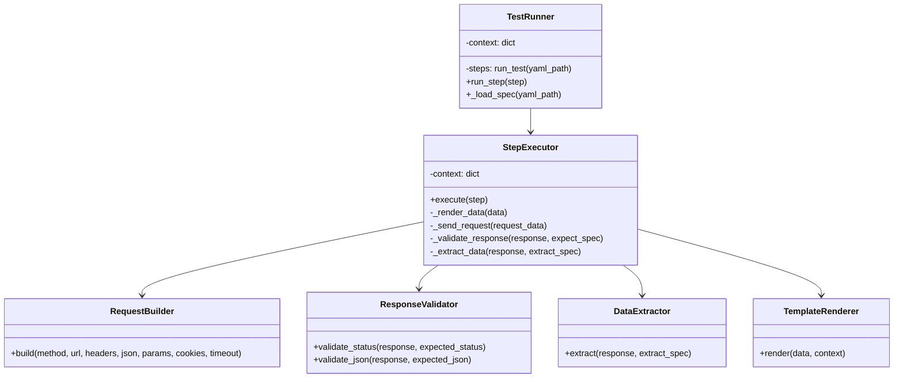

# План рефакторинга parser.py в ООП стиле

## Цель
Перевести модуль `src/yatl/parser.py` из процедурного стиля в объектно-ориентированный, улучшив структуру кода, разделив ответственность и облегчив дальнейшее расширение.

## Текущее состояние
Файл `parser.py` содержит 123 строки, включает функции:
- `render_data` – рендеринг шаблонов Jinja2.
- `extract_data` – извлечение данных из JSON-ответа.
- `check_expectations` – валидация статуса и JSON-ответа.
- `run_step` – выполнение одного шага теста.
- `run_test` – запуск всего теста из YAML-файла.

Код работает, но смешивает логику рендеринга, HTTP-запросов, валидации и извлечения данных.

## Предлагаемая архитектура

## Пошаговый план

### Шаг 1: Создать класс `TemplateRenderer`
**Задача:** Вынести функцию `render_data` в отдельный класс.
**Файл:** `src/yatl/renderer.py` (или внутри `parser.py`).
**Действия:**
1. Создать класс `TemplateRenderer` с методом `render(self, data, context)`.
2. Перенести логику рендеринга из `render_data` в этот метод.
3. Обеспечить поддержку строк, словарей и списков.
4. Обновить `run_step`, чтобы использовать `TemplateRenderer.render` вместо `render_data`.
**Ожидаемый результат:** Класс работает идентично старой функции.

### Шаг 2: Создать класс `DataExtractor`
**Задача:** Вынести функцию `extract_data` в класс.
**Файл:** `src/yatl/extractor.py`.
**Действия:**
1. Создать класс `DataExtractor` с методом `extract(self, response, extract_spec)`.
2. Перенести логику извлечения данных.
3. Обработать случай, когда `path` равен `None`.
4. Обновить `run_step`, чтобы использовать экземпляр `DataExtractor`.
**Ожидаемый результат:** Извлечение данных работает как раньше.

### Шаг 3: Создать класс `ResponseValidator`
**Задача:** Вынести функцию `check_expectations` в класс.
**Файл:** `src/yatl/validator.py`.
**Действия:**
1. Создать класс `ResponseValidator` с методом `validate(self, response, expect_spec)`.
2. Разделить проверку статуса и JSON на отдельные приватные методы.
3. Обновить `run_step`, чтобы использовать `ResponseValidator`.
**Ожидаемый результат:** Валидация ответов работает корректно.

### Шаг 4: Создать класс `RequestBuilder`
**Задача:** Вынести логику построения запроса из `run_step` в отдельный класс.
**Файл:** `src/yatl/request_builder.py`.
**Действия:**
1. Создать класс `RequestBuilder` с методом `build(self, request_data, context)`.
2. Метод должен обрабатывать URL (добавлять base_url), headers, json, params, cookies, timeout.
3. Возвращать словарь с параметрами для `requests.request`.
4. Обновить `run_step`, чтобы использовать `RequestBuilder`.
**Ожидаемый результат:** Запросы строятся корректно.

### Шаг 5: Создать класс `StepExecutor`
**Задача:** Объединить все вышеперечисленные классы в одном классе, который выполняет шаг.
**Файл:** `src/yatl/step_executor.py`.
**Действия:**
1. Создать класс `StepExecutor` с полями: `template_renderer`, `data_extractor`, `response_validator`, `request_builder`.
2. Добавить метод `execute(self, step, context)`, который:
   - рендерит шаг,
   - строит запрос,
   - отправляет его,
   - валидирует ответ,
   - извлекает данные,
   - обновляет контекст.
3. Перенести код из `run_step` в этот метод, используя созданные классы.
**Ожидаемый результат:** `StepExecutor` может выполнить один шаг теста.

### Шаг 6: Создать класс `TestRunner`
**Задача:** Вынести функцию `run_test` в класс.
**Файл:** `src/yatl/test_runner.py`.
**Действия:**
1. Создать класс `TestRunner` с методом `run_test(self, yaml_path)`.
2. Внутри метода загрузить YAML, создать контекст, инициализировать `StepExecutor`.
3. Пройтись по шагам, вызывая `step_executor.execute`.
4. Сохранить вывод в консоль (print) как в оригинале.
**Ожидаемый результат:** Весь тест запускается через `TestRunner`.

### Шаг 7: Интеграция и сохранение API
**Задача:** Обеспечить обратную совместимость — оставить функции `run_test` и `run_step` (они могут использовать новые классы).
**Файл:** `src/yatl/parser.py`.
**Действия:**
1. Импортировать классы.
2. Переписать `run_step` так, чтобы она создавала экземпляр `StepExecutor` и вызывала его.
3. Переписать `run_test` так, чтобы она создавала `TestRunner` и запускала его.
4. Убедиться, что старые вызовы из других модулей (если есть) продолжают работать.
**Ожидаемый результат:** Внешнее поведение не изменилось, все тесты проходят.

### Шаг 8: Написать unit-тесты для новых классов
**Задача:** Покрыть новые классы тестами.
**Файл:** `tests/test_parser_oop.py`.
**Действия:**
1. Написать тесты для `TemplateRenderer` с разными типами данных.
2. Написать тесты для `DataExtractor` с mock-ответом.
3. Написать тесты для `ResponseValidator`.
4. Написать интеграционный тест для `StepExecutor`.
**Ожидаемый результат:** Все тесты проходят, покрытие >80%.

### Шаг 9: Рефакторинг и чистка кода
**Задача:** Удалить старые функции, если они больше не используются, привести код в соответствие с PEP8.
**Файл:** `src/yatl/parser.py`.
**Действия:**
1. Удалить `render_data`, `extract_data`, `check_expectations` (или оставить как обёртки для совместимости).
2. Проверить, нет ли дублирования.
3. Обновить документацию (docstrings).
**Ожидаемый результат:** Чистый, хорошо структурированный код.

### Шаг 10: Финальное тестирование
**Задача:** Запустить существующие тесты (если есть) и пример `example.test.yaml`.
**Действия:**
1. Запустить `python -m pytest tests/`.
2. Запустить `python src/yatl/parser.py` (должен выполнить пример).
3. Убедиться, что вывод идентичен оригиналу.
**Ожидаемый результат:** Всё работает.

## Рекомендации по работе со стажером
1. **Объяснить цель:** "Мы хотим перевести parser.py в ООП стиль для улучшения кодовой базы. Вот план из 10 шагов."
2. **Давать по одному шагу:** После завершения каждого шага проводить код-ревью, давать обратную связь.
3. **Учить принципам ООП:** Обсуждать инкапсуляцию, единую ответственность, композицию.
4. **Постепенно усложнять:** После успешного завершения шага 1 давать шаг 2 и т.д.
5. **Использовать инструменты:** PyTest, линтеры (flake8, black), отладчик.

## Оценка времени
- **Общее время:** 2–3 недели (при частичной занятости).
- **Сложность каждого шага:** низкая/средняя.
- **Риски:** Стажер может запутаться в интеграции, но с руководством справится.

## Критерии успеха
- Код разделён на классы с чёткой ответственностью.
- Сохранена обратная совместимость (существующие тесты проходят).
- Написаны unit-тесты для новых классов.
- Код соответствует PEP8 и внутренним стандартам проекта.

---
*План составлен 2026-03-04. Актуализировать по мере выполнения.*